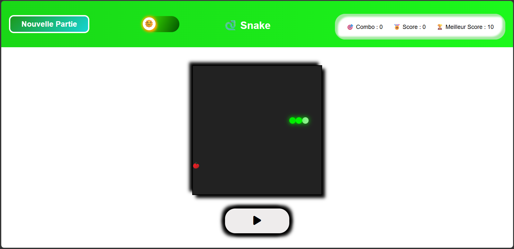
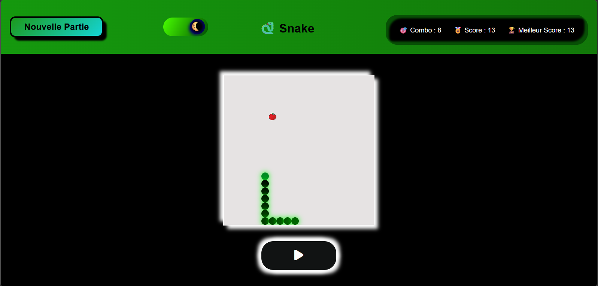

# Projet Snake

## Pourquoi ?
Ce projet est issu d'une idée capricieuse, j'ai vu beaucoup de mini-jeux créés en développement web et à force d'en voir, je me suis juste dit : "Si eux ils peuvent le faire alors pourquoi pas moi". L'objectif est donc juste de créer un mini-jeu snake. 

## Comment récupérer le projet ?

Pour récupérer le projet, il suffit de taper la commande suivante dans un terminal:
```bash
git clone https://github.com/Riders08/Snake.git
```

Une fois cela fait normalement un dossier nommé "Snake" sera apparu à la racine de votre chemin actuel.
Pour le vérifier il suffit de taper la commande :
```bash
ls # Pour afficher le contenu du dossier courant
cd Snake #Pour vous rendre dans le dossier 
```
## Comment lancer le jeu ?

Pour lancer le jeu, deux choix s'offrent à vous.

### Vous souhaitez lancer le jeu via le projet que vous venez de récupérer

Dans cette situation, il suffit de taper les commandes suivantes:

```bash
cd Snake # Rendez-vous dans le dossier du projet si vous n'y êtes pas encore
npx http-server .
```
Une fois que vous aurez tapé cette commande, vous aurez très probablement une ou plusieurs adresses, il ne vous restera plus qu'à la copier-coller l'une d'entre elles dans n'importe quel navigateur web:

```bash
http://127.0.0.1:8080 # Exemple d'adresse possible
```

Alternative possible : Si vous avez un environnement de travail tel que Visual Studio Code, vous pouvez également utiliser des outils comme Live Server pour lancer ce projet

#### Note Importante

Attention pour faire cela il faut au préalable avoir Node.js que vous pouvez retrouver ici: 
```bash
https://nodejs.org
```

Si vous êtes sous Windows et que la commande `npx` ne fonctionne pas,
ouvrez PowerShell en mode administrateur.

### Vous souhaitez lancer le jeu le plus facilement possible

Rendez-vous sur cette adresse pour directement accéder au jeu:

```bash
https://riders08.github.io/Snake/
```

### Note Importante

Le projet n’a pas été testé sur macOS mais devrait fonctionner
sur tout navigateur moderne compatible ES6.<br>
De plus, ce projet a été testé sur les navigateurs web suivants :
- Microsoft Edge
- Firefox 
- Chrome
- Opera GX

## Fonctionnalités

Vous retrouverez donc dans ce jeu :

- 1 Mode Normal
- 1 Mode Facile
- Système de combo et de score
- Pommes bonus
- Augmentation progressive de la vitesse (Mode Normal uniquement)
- Thème clair / sombre
- Sauvegarde du meilleur score (localStorage)


## Aperçu



